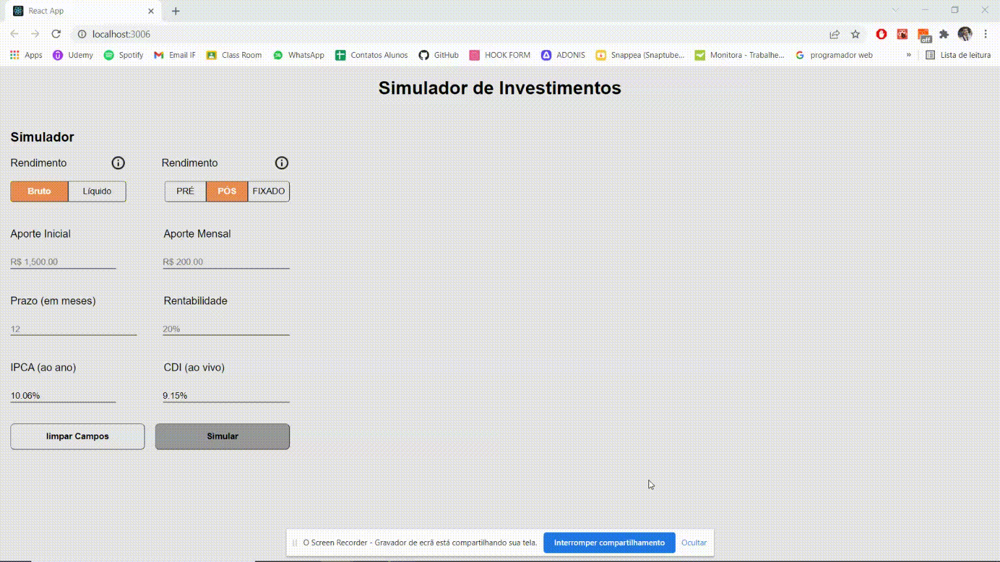

# Desafio Eqi Investimentos - Front End

Uma aplicação front end estilo dashboard de simulação de investimentos propostos pela empresa EQI Investimentos.

Requisitos: 
   * NodeJS.
   * NPM.
   * [Backend Desafio Fake Api. ](https://github.com/eqi-investimentos/desafio-fake-api)
   
## Rodando localmente

Clone o projeto

```bash
  git clone https://github.com/davimarquesgiareta/desafio-eqi.git
```

Entre no diretório do projeto

```bash
  cd desafio-eqi
```

Instale as dependências

```bash
  npm i
```

Inicie o servidor

```bash
  npm run start
```


## Demonstração

<p align="center">
  
</p>

## Bibliotecas

* [Apex Charts.js](https://apexcharts.com/) (Geração dos Gráficos).
* [Axios](https://www.npmjs.com/package/axios) (Requisições AJAX).
* [React Currency Format](https://www.npmjs.com/package/axios) (Formatação do dinheiro e validação do campo).
* [Jest.js ](https://jestjs.io/pt-BR/) (Testes unitários).

## Informações Adicionais

* Responsividade para dispostiveis móveis.
* Código Formatado com o Prettier.
* Otimização para SEO (meta tags).

